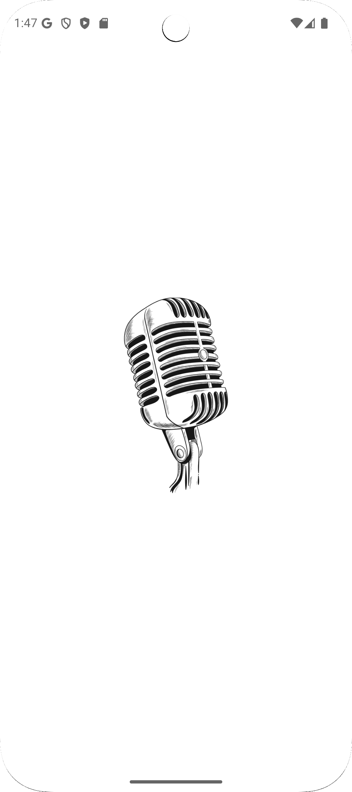
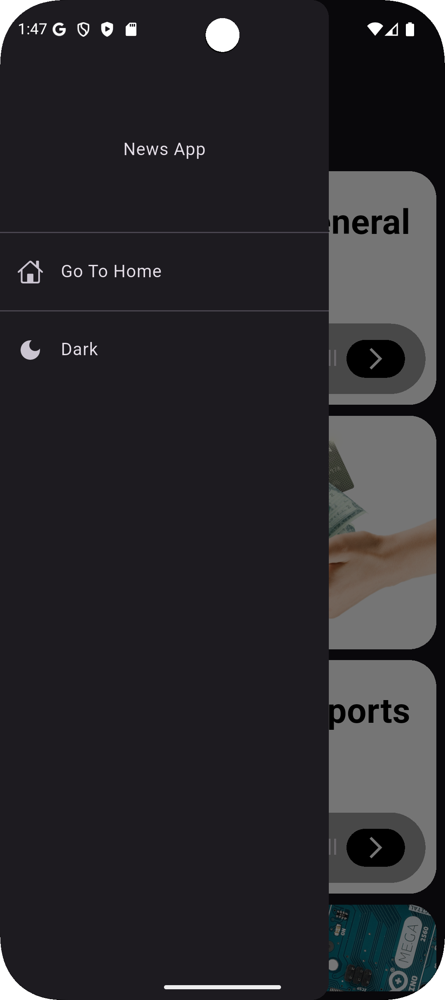
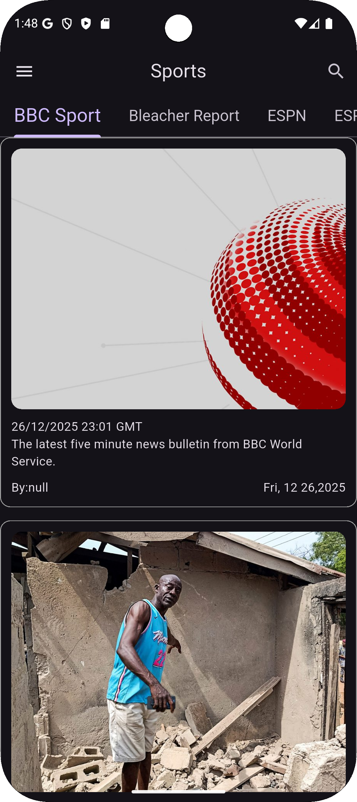
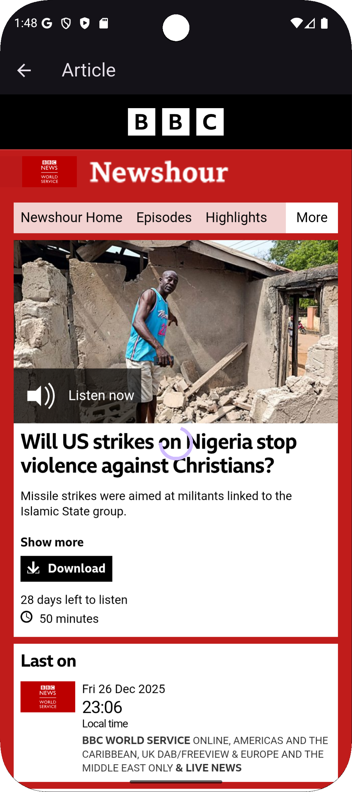

<p align="center">
  
</p>

# News App 📰
A modern news mobile application built with Flutter.

News App allows users to browse the latest news by categories, read full articles inside the app using WebView, and enjoy a clean dark-themed UI with smooth navigation.

---

## 🚀 Features
- Browse Latest News
- News Categories (Sports, Business, etc.)
- Article Details Screen
- In-App WebView for Full Articles
- Drawer Navigation
- Clean Dark UI
- REST API Integration
- Responsive UI (Android & iOS)

---

## 🛠️ Tech Stack
- Flutter & Dart
- REST APIs
- Provider (State Management)
- Clean Architecture
- WebView
- Custom UI Components

---

## 📱 App Screenshots

<p align="center">
  
  
  
</p>

<p align="center">
  
  
  
</p>

---

## 📦 Project Structure
```text
lib/
 ├── api/
 │    ├── model/
 │    └── api_manager.dart
 │
 ├── core/
 │    ├── extensions/
 │    ├── providers/
 │    └── resources/
 │
 ├── data/
 │    └── model/
 │         └── category_model.dart
 │
 ├── presentation/
 │    ├── category_screen/
 │    ├── common/
 │    ├── home/
 │    ├── news_screen/
 │    └── splash/
 │
 └── main.dart
 
 
👨‍💻 Author

Abdelrahman Ghanima
Flutter Mobile Application Developer


⭐ Show Your Support

If you like this project, give it a ⭐ on GitHub!